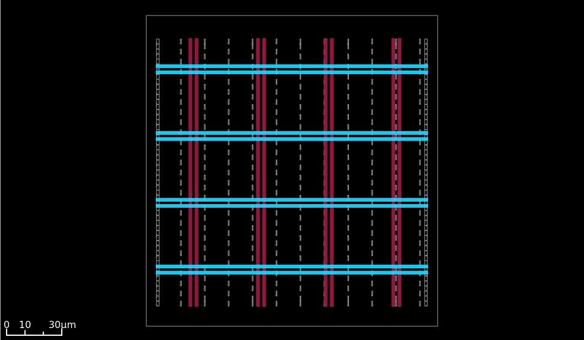
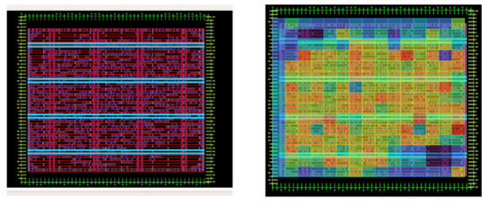
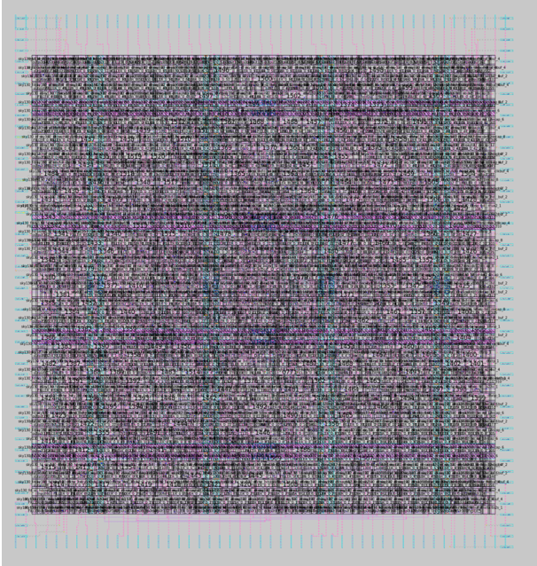

# Thiết Kế Vật Lý Lõi Vi Xử Lý SERV RISC-V (RTL-to-GDSII)

## 📌 Giới Thiệu Dự Án
Kho lưu trữ này chứa toàn bộ quá trình thực hiện thiết kế vật lý (từ mã RTL đến bản vẽ thi công GDSII) cho lõi vi xử lý **SERV RISC-V**. Dự án sử dụng bộ công cụ phát triển phần cứng **SkyWater 130nm (sky130)** (PDK) và được vận hành tự động thông qua luồng thiết kế **OpenLane**.

Mục tiêu cốt lõi của dự án là tối ưu hóa diện tích cực đại (Area Optimization) cho con chip trong khi vẫn đảm bảo tuyệt đối khả năng đi dây (Routability) và tính toàn vẹn của tín hiệu.

## 🛠️ Công Cụ & Công Nghệ
* **Kiến trúc lõi:** SERV (Serial RISC-V CPU - Lõi RISC-V nhỏ nhất thế giới)
* **Công nghệ chế tạo (Process Node):** SkyWater 130nm (`sky130_fd_sc_hd`)
* **Luồng thiết kế EDA:** OpenLane
* **Tổng hợp logic (Synthesis):** Yosys
* **Sơ đồ mặt bằng & Sắp xếp (Floorplan & Placement):** OpenROAD / RePlAce
* **Xem bản vẽ Layout (Layout Viewer):** Magic / OpenROAD GUI

## ⚙️ Cấu Hình Thiết Kế (Configurations)
Để ép cấu trúc chip vào diện tích nhỏ nhất có thể, các thông số môi trường đã được tinh chỉnh khắt khe so với mặc định:
* **Mật độ rải linh kiện mục tiêu (`PL_TARGET_DENSITY`):** `0.60` (60%)
* **Tỷ lệ sử dụng vùng lõi (`FP_CORE_UTIL`):** `44` (%)
* **Chiến lược tổng hợp (`SYNTH_STRATEGY`):** Cực đại hóa tối ưu diện tích (`AREA 0`)

## 📊 Các Giai Đoạn Phân Tích & Kết Quả

### 1. Sơ đồ mặt bằng & Lưới điện (Floorplan & PDN)
Mặt bằng chip được thiết lập với tỷ lệ khung hình (Aspect Ratio) tương đối là 1:1. Hệ thống lưới phân phối nguồn (Power Distribution Network - PDN) được tổng hợp chắc chắn trên các lớp kim loại cao (`met4`, `met5`) để cung cấp dòng VDD và GND ổn định cho toàn bộ các cổng logic bên trong.


*(Hình ảnh: Lưới phân phối nguồn PDN của lõi SERV)*

### 2. Rải cổng logic (Standard Cell Placement)
Thuật toán Nesterov-based được sử dụng để tối ưu hóa vị trí cho hơn 600+ cổng logic (Standard Cells). Mặc dù mật độ mục tiêu bị ép lên mức khá cao (0.60), thuật toán vẫn giải quyết thành công bài toán không gian với chỉ số nghẽn mạch (Total Overflow) cực kỳ lý tưởng: **< 0.1** (đạt mức `0.099588` tại vòng lặp cuối). Điều này khẳng định chip có thiết kế rất "thoáng" và sẵn sàng cho việc kéo dây.


*(Hình ảnh: Các Standard Cells được sắp xếp ngay ngắn vào các hàng định tuyến)*

### 3. Nối dây & Đóng gói (Routing & Sign-off)
Hệ thống đã tự động định tuyến toàn bộ dây dẫn điện (Global & Detailed Routing) qua các lớp kim loại. Bản vẽ GDSII cuối cùng đã vượt qua tất cả các bài kiểm tra nghiêm ngặt nhất: Không có lỗi đoản mạch/đứt mạch (DRC Clean), khớp sơ đồ nguyên lý (LVS Clean) và không dính lỗi hiệu ứng ăng-ten (Antenna Clean).


*(Hình ảnh: Bản vẽ thi công cuối cùng với các lớp kim loại đan xen)*

## 🚀 Hướng Dẫn Chạy Lại Luồng (Reproduction)
Để tái hiện lại chính xác kết quả của dự án này, hãy khởi động môi trường Docker của OpenLane và thực thi các lệnh tương tác sau:

```tcl
# 1. Khởi tạo và dọn sạch không gian làm việc
prep -design serv_opt -overwrite

# 2. Thực thi các bước thiết kế vật lý
run_yosys
run_floorplan
run_placement
run_routing
run_magic
```
## 👥Author
### Thực hiện: Đặng Thanh Sơn, Nguyễn Quang Tú, Nguyễn Tuấn Anh và Nguyễn Bá Cường
### Môn học: Thiết kế vi mạch số
